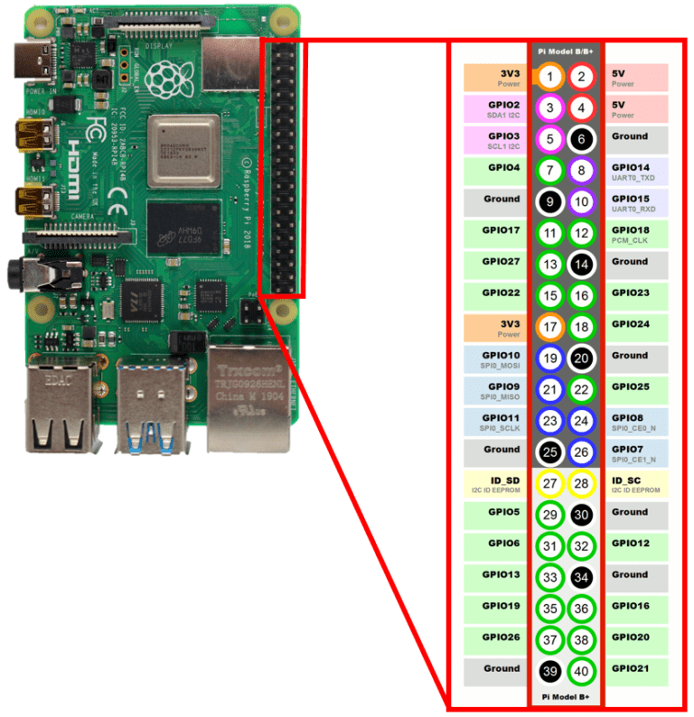

# Arcade Timer

Таймер аренды игрового автомата «Аркада» для **Batocera** на **Raspberry Pi 5**.

Портирован с [Arduino-проекта](https://github.com/TIMON72/Arcade_Timer_Arduino): управление реле кнопок автомата, обратный отсчёт на LED-матрице MAX7219, веб-интерфейс для тестов.

## Возможности

| Событие | Дисплей / действие |
|--------|---------------------|
| Простой (00:00:00) | Бегущая строка из конфига |
| Кнопка «+» | Время `MM:SS` или `HH:MM` |
| Старт / возобновление | «ИГРА» + обратный отсчёт |
| Пауза | «ПАУЗА» |
| Идёт отсчёт | Обновление каждую секунду |
| Режим ожидания | `$?SS` (рубль, вопрос, секунды) |
| Стоп | «КОНЕЦ» → пауза → снова бегущая строка |
| Время выставлено, игра не запущена | Автосброс через `time_reset` минут |

Веб-сервер (`aiohttp`): порт из `[server]` в конфиге (по умолчанию **5000**): `GET /test?action=...` для удалённых команд.

## Структура репозитория

```
Arcade/
├── batocera.conf          # настройки Batocera (system.services=main)
├── deploy.sh              # скрипт принудительного deploy
├── pins.png               # схема распиновки GPIO (BCM)
├── requirements.txt       # только для vendor-wheels (не deploy)
├── wheels/                # офлайн-пакеты pip (aarch64, Python 3.12)
├── configs/               # пользовательские конфиги Batocera
├── services/
│   └── main               # сервис Batocera (start/stop/status)
└── scripts/
    ├── main.py            # точка входа, deploy, venv
    ├── config_main.toml   # конфиг сервера, таймера, GPIO и матрицы
    ├── timer.py           # логика таймера и GPIO
    ├── server.py          # веб-сервер
    └── modules/
        ├── matrix.py      # драйвер MAX7219 (luma, bitbang SPI)
        ├── matrix_glyphs.py
        ├── matrix_font5x8.py
        └── lgpio_gpio.py
```

### После развёртывания на Batocera

```
/userdata/system/
├── .arcade-deployed       # маркер первого deploy (не в git)
├── batocera.conf
├── configs/
├── services/main
└── scripts/
    ├── main.py
    ├── modules/
    ├── wheels/            # копия из репозитория
    ├── config_main.toml
    └── venv/              # создаётся при первом запуске
```

Репозиторий может лежать **где угодно** (флешка, `/userdata/system/Arcade`, и т.д.). Рабочие пути Batocera фиксированы: `/userdata/system/scripts` и `/userdata/system/services`.

## Требования

| Компонент | Где |
|-----------|-----|
| Batocera, Python 3.12 | система |
| `lgpio`, `aiohttp` | системный Python Batocera |
| `luma.led_matrix` | venv (ставится офлайн из `wheels/`) |

Интернет на консоли **не обязателен** — wheel-файлы включены в репозиторий.

## Развёртывание на Batocera

Скопируйте **весь** проект на консоль (git clone, SCP, флешка) — нужны каталоги `configs/`, `services/`, `scripts/`, `wheels/` и файл `batocera.conf`. Репозиторий может лежать где угодно, например `/userdata/system/Arcade`.

Deploy копирует файлы в фиксированные пути Batocera: `/userdata/system/scripts`, `/userdata/system/services` и т.д. Запускать deploy нужно **из копии проекта**, а не из `/userdata/system/scripts`.

### Способ 1: без явного deploy (первый запуск)

При **первом** вызове `main.py` deploy выполняется автоматически (пока нет маркера `/userdata/system/.arcade-deployed`):

```bash
cd /userdata/system/Arcade
python3 scripts/main.py
```

Что произойдёт:

1. Скопирует `configs/`, `services/`, `scripts/` (включая `config_main.toml`), `wheels/` в `/userdata/system/`
2. Перезапишет `batocera.conf` версией из проекта
3. Создаст маркер `.arcade-deployed`
4. Создаст `venv` в `/userdata/system/scripts/` и установит `luma` из локальных wheels
5. Запустит таймер в **текущем** процессе (из каталога `Arcade/`)

Для постоянной работы после первого запуска лучше поднять сервис (он использует уже развёрнутый `/userdata/system/scripts/main.py`):

```bash
batocera-services restart main
batocera-services status main
```

Повторный `python3 scripts/main.py` из `Arcade/` **не обновит** файлы в `/userdata/system/` — для обновлений используйте способ 2.

### Способ 2: явный deploy (обновления и повторная установка)

Принудительно перезаписывает файлы в `/userdata/system/`, даже если deploy уже выполнялся.

**Через скрипт** (рекомендуется):

```bash
cd /userdata/system/Arcade
./deploy.sh              # только deploy
./deploy.sh --restart    # deploy + перезапуск сервиса
```

**Через main.py** (то же самое, без перезапуска сервиса):

```bash
cd /userdata/system/Arcade
python3 scripts/main.py deploy
batocera-services restart main
```

Альтернатива для повторного авто-deploy без `deploy`: удалить маркер и снова запустить `main.py`:

```bash
rm /userdata/system/.arcade-deployed
python3 scripts/main.py
```

### Сравнение способов

| Команда | Deploy | Запуск таймера | Когда использовать |
|---------|--------|----------------|-------------------|
| `python3 scripts/main.py` | только первый раз | да | первая установка |
| `python3 scripts/main.py deploy` | всегда | нет | обновление файлов |
| `./deploy.sh` | всегда | нет | обновление файлов |
| `./deploy.sh --restart` | всегда | через сервис | обновление + перезапуск |
| `batocera-services restart main` | нет | через сервис | обычный перезапуск |

### Автозапуск при загрузке

В `batocera.conf` проекта указано `system.services=main` — после deploy оно попадает в `/userdata/system/batocera.conf`. Перезагрузите консоль:

```bash
reboot
```

Или включите сервис вручную: `batocera-services enable main`

### Логи и проверка

```bash
batocera-services status main
```

| Лог | Путь |
|-----|------|
| Сервис (stdout/stderr) | `/userdata/system/logs/main-service.log` |
| Приложение | `/userdata/system/scripts/logs.log` |

В логе должны быть строки `MAIN service STARTED` и `'server.py' started`. Веб-интерфейс: `http://<IP-консоли>:5000/`

## Команды main.py

```bash
python3 scripts/main.py              # авто-deploy (если первый раз) + запуск
python3 scripts/main.py deploy       # принудительный deploy
python3 scripts/main.py vendor-wheels   # скачать wheels (нужен интернет и pip)
```

## Конфигурация

Файл `scripts/config_main.toml` (после deploy — `/userdata/system/scripts/config_main.toml`).

```toml
[server]
port = 5000

[timer]
time_step = 5      # шаг «+», минуты
time_wait = 60     # пауза после окончания, секунды
time_reset = 5       # автосброс без старта, минуты

[gpio]
rf_increase = 5
rf_playpause = 6
rf_stop = 13
r_buttons = 17
r_playpause = 27
r_stop = 22
relay_active_low = true

[matrix]
enabled = true
brightness = 7
scroll_speed = 7
text_display = "АРЕНДА: т. +79233549295"
din = 10
clk = 11
cs = 8
cascaded = 4
block_orientation = 90
blocks_reverse = true
rotate = 2
test_on_start = true
```

## Аппаратура



- **Raspberry Pi 5** с Batocera
- Реле автомата (GPIO 17, 27, 22)
- RF-кнопки пульта (GPIO 5, 6, 13)
- MAX7219: 4 модуля 8×8 в ряд, bitbang SPI (DIN=10, CLK=11, CS=8)
- Общая земля Pi и блока питания матрицы обязательна

## Разработка

```bash
# venv (создаётся автоматически при первом запуске main.py)
python3 scripts/main.py

# Обновить wheels на машине с интернетом
python3 scripts/main.py vendor-wheels
git add wheels/
```

В VS Code: конфигурации запуска в `.vscode/launch.json` (`Main`, `Server`, `Timer`, `All`).

### Зависимости

- **В git:** `wheels/` (офлайн-установка на консоли)
- **Не в git:** `venv/`, `logs.log`, `.arcade-deployed`
- **`requirements.txt`** — только для `vendor-wheels`, на Batocera не копируется

## Лицензия и авторство

Основано на проекте [Arcade_Timer_Arduino](https://github.com/TIMON72/Arcade_Timer_Arduino) (Радионов Тимофей).
