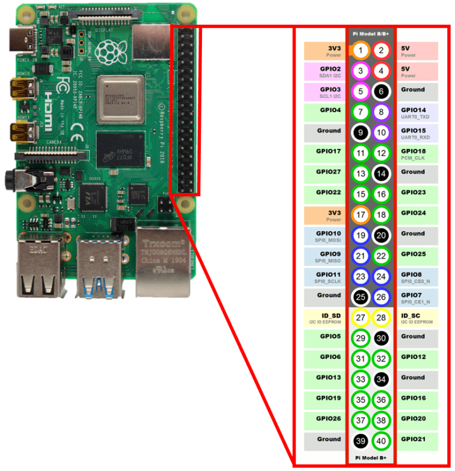

# Arcade Timer

Таймер аренды «Аркада» для Batocera на Raspberry Pi 5.  
Исходник: [Arcade_Timer_Arduino](https://github.com/TIMON72/Arcade_Timer_Arduino).

## Установка (после Batocera)

1. Положить проект в `/userdata/system/Arcade` (клон или копия).
2. Один раз:

```bash
/userdata/system/Arcade/install
reboot
```

3. Готово. Сервисы: `main`, `timer`, `server`, `tvon`.

### Обновление

```bash
cd /userdata/system/Arcade && git pull && reboot
```

`main` при старте сам задеплоит изменения из Arcade в `/userdata/system/scripts` и `/userdata/system/services`.

| Путь | Роль |
|------|------|
| `/userdata/system/Arcade` | исходники |
| `/userdata/system/scripts` | рабочий код |
| `/userdata/system/services` | скрипты сервисов Batocera |

Принудительно без reboot: `python3 /userdata/system/Arcade/scripts/main/main.py deploy`

## Сервисы

| Сервис | Что делает |
|--------|------------|
| **main** | deploy, venv, лог, SSH; при старте sync Arcade → system |
| **timer** | GPIO, таймер, матрица; Unix-сокет команд |
| **server** | HTTP `:5000`, webhooks → `modules/` |
| **tvon** | HDMI-CEC, включение ТВ |

Команда таймеру: `http://<IP>:5000/test?action=INCREASE|PLAYPAUSE|STOP|ADD_<INT>`  
→ `server/modules/timer.py` → сокет → `timer.action()`.

## Конфиг

У каждого модуля свой файл (править в Arcade, затем sync/reboot):

- `scripts/main/config.toml` — SSH  
- `scripts/timer/config.toml` — режим, GPIO, терминал, матрица, `cmd_socket`  
- `scripts/server/config.toml` — `port`, `timer_socket`  
- `scripts/tvon/config.toml` — CEC  

`cmd_socket` и `timer_socket` должны совпадать (по умолчанию `/var/run/arcade-timer.sock`).

`timer_mode`: `Raspberry` (Pi сам) или `Arduino` (Pi имитирует радио).

## Проверка

```bash
batocera-services status main
batocera-services status timer
batocera-services status server
```

Логи: `/userdata/system/logs/<сервис>-service.log`, `/userdata/system/scripts/logs.log`

## Железо



| Что | Пины (BCM) |
|-----|------------|
| RF + / play / stop | 5 / 6 / 13 |
| Реле buttons / play / stop | 17 / 27 / 22 |
| Терминал (сухой контакт) | 26 (+ GND) |
| MAX7219 DIN / CLK / CS | 10 / 11 / 8 |

Общая земля Pi и БП матрицы обязательна.

## Разработка

Debug: **Arcade** (Main + Timer + Server). Логи — в **Debug Console** (не Terminal), чтобы окна не плодились.  
Сессию переключай в Call Stack: Main / Timer / Server. Отдельно те же конфиги + Tvon.
Офлайн-зависимости в репо: `wheels/`, `vendor/git/`, `vendor/vscode/`.  
Не в git: `.venv/`, `logs.log`, `.arcade-deployed`.
